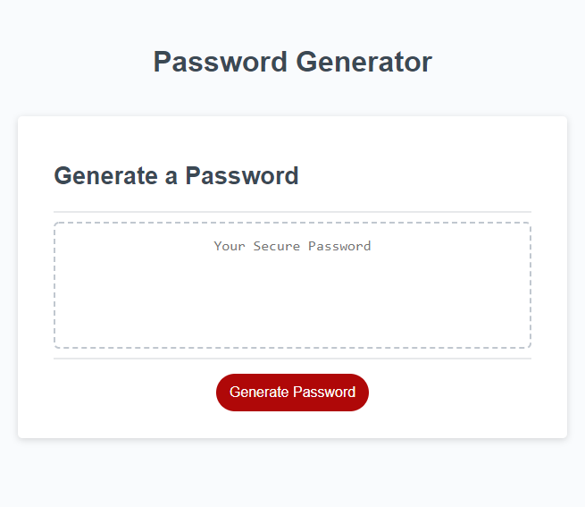

# Password Generator

## Description 

This is a simple application to generate a password.  The user will be prompted to supply the following criteria:

   * A password length, between 8 and 128

   * At least one of more of the follow character options:

      * Include lower case characters

      * Include upper case character
   
      * Include numbers
   
      * Include special characters

Upon valid input, a password will be generated and displayed on the screen.  Otherwise, the user will be alerted to any input errors.

## Usage 

This site is published at  https://smaryroy.github.io/PasswordGenerator/

## Credits

Password special characters as provided by 
https://owasp.org/www-community/password-special-characters

In according with assignments provided by University of Minnesota Coding Bootcamp.

https://bootcamp.umn.edu/

